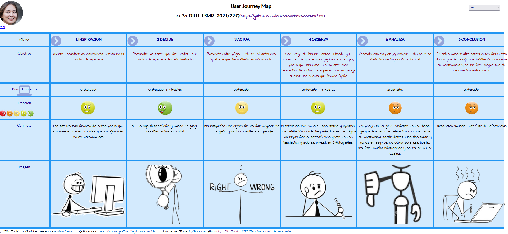

## DIU - Practica1, entregables

## Desk research: Análisis Competencia 

Al realizar el análisis competitivo de 4uHostel, hemos definido 11 características que nos parecen relevantes como cliente a la hora de consultar la página web de un hostel con el fin una reserva.
Lo hemos comparado con otros dos hosteles: el primero se llama **Woohoo Group**, situado en Madrid y el segundo **Soho**, situado en Málaga. Destacamos que todos son de España para poder comparar dentro de una misma cultura y costumbres.

Principalmente **destaca** por resaltar un contacto directo (número de teléfono) de manera vistosa, mientras en otros hay que rebuscar y puede ser complicado encontrarlo. Por otra parte, un punto a favor es que recomienda lugares que visitar cerca y así los clientes que no conozcan la zona tendrán planes asegurados.

Como **puntos negativos** podemos destacar que no detalla las diferentes maneras de llegar (como hace Woohoo), como desde el Aeropuerto, lugares concurridos… Además, podría incluir un servicio de Parking ya que esta característica es muy valorada por los clientes (hay que tener en cuenta que se sitúa en el centro y no suele haber aparcamiento). Un punto muy negativo es que no incluye información acerca del Covid-19, un factor a tener muy en cuenta en estos últimos años. Por último, frente a sus competidores se queda atrás en su disponibilidad geográfica, ya que sólo se encuentra en Granada y los demás disponen de hosteles en varias ciudades de España, aunque esta característica no es muy importante si el cliente tiene claro su destino. 

Como **resultado** tenemos que el hostel elegido tiene puntos importantes mejorables, aunque destaca favorablemente en otros.

## Personas 

La primera persona es una joven estudiante de Historia llamada Mei, la cual pasará cinco días en Granada junto a su pareja. Su principal objetivo es encontrar inspiración para su Trabajo de Fin de Grado.

Como segunda persona encontramos a Claudia, una mujer influencer que se dedica a realizar patrocinios con empresas. 

## User Journey Maps

**Mei**

Mei desea hacer una reserva en un sitio barato para visitar Granada con su pareja y que le sirva como inspiración en tu Trabajo de Fin de Grado. Surgen algunas disputas con su pareja ya que no está tan interesada como ella en ese viaje.

Finalmente encuentra una solución aunque tiene una ventaja frente a su pareja: es estudiante y por ello en algunas visitas tiene descuento.

**Claudia**

Claudia quiere organizar un viaje a Granada con el fin de crecer en sus redes sociales y ganar dinero haciendo patrocinios a diferentes marcas. Además, realizará quedadas con otros influencers por lo que tendrá que organizarse con ellos. 

Las marcas a las que va a hacerle publicidad en este viaje no le pagan el alojamiento, por lo que sus amigos influencers le recomiendan un hostel que, con suerte, tenía disponibilidad en las fechas que buscaba.

## Revisión de Usabilidad 
Enlace al documento [PDF](RevisionUsabilidadLSMR.pdf).

Como resumen podemos destacar que es una página web que cumple con su principal objetivo, realizar una reserva online. No dispone de recursos de ayuda para personas que no tienen conocimientos sobre páginas web. Además está acotada a un público español o inglés, un punto importante en un negocio turístico.

Valoración y conclusiones: Valoramos la página positivamente por su simplicidad y diseño, pero al hacer el estudio de usabilidad, decidimos que hay puntos importantes en los que debe mejorar, destacando el hecho de que existen dos páginas web para el mismo negocio, aparentemente iguales.
