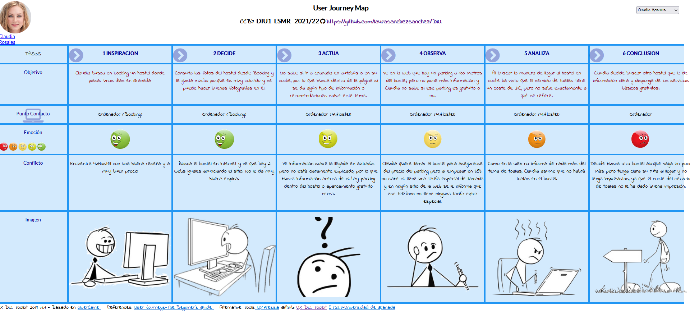

## DIU - Practica1, entregables

## Desk research: Análisis Competencia 

Al realizar el análisis competitivo de **4uHostel**, hemos definido 11 características que nos parecen relevantes como cliente a la hora de consultar la página web de un hostel con el fin una reserva.
Lo hemos comparado con otros dos hosteles: el primero se llama **Woohoo Group**, situado en Madrid y el segundo **Soho**, situado en Málaga. Destacamos que todos son de España para poder comparar dentro de una misma cultura y costumbres.

Principalmente **destaca** por resaltar un contacto directo (número de teléfono) de manera vistosa, mientras en otros hay que rebuscar y puede ser complicado encontrarlo. 

Como **puntos negativos** podemos destacar que no detalla claramente las diferentes maneras de llegar (como hace Woohoo), como desde el Aeropuerto, lugares concurridos… Un punto muy negativo es que no incluye información acerca del Covid-19, un factor a tener muy en cuenta en estos últimos años. 

Concluímos que frente a sus competidores se queda atrás el valor de la información que muestra, ya que no detalla exactamente los servicios que ofrece, mientras que Woohoo sí.

Como **resultado** tenemos que el hostel elegido tiene características mejorables.

Enlaces web:

4uHostel
- https://www.4uhostel.com/ 
- https://www.hostel4ugranada.com/

Woohoo Group
- https://www.woohoo-group.com/es/ 

Soho
- http://www.feelhostels.com/hostel_soho.php 

## Personas 

La primera persona es una joven estudiante de Historia llamada **Mei**, nacida en España pero con ascendencia china, la cual pasará cinco días en Granada junto a su pareja. Su principal objetivo es encontrar inspiración para su Trabajo de Fin de Grado.

Como segunda persona encontramos a **Claudia**, una mujer influencer que se dedica a realizar patrocinios con empresas. 

## User Journey Maps

Hemos escogido estas experiencias ya que consideramos que son bastante habituales entre la gente joven, especialmente la de Mei.

**Mei**

Mei desea hacer una reserva en un sitio barato para visitar Granada con su pareja y que le sirva como inspiración en tu Trabajo de Fin de Grado. Surgen algunas disputas con su pareja ya que no está tan interesada como ella en ese viaje.

Finalmente encuentra una solución aunque tiene una ventaja frente a su pareja: es estudiante y por ello en algunas visitas tiene descuento.

**Claudia**

Claudia quiere organizar un viaje a Granada con el fin de crecer en sus redes sociales y ganar dinero haciendo patrocinios a diferentes marcas. Además, realizará quedadas con otros influencers por lo que tendrá que organizarse con ellos. 

Las marcas a las que va a hacerle publicidad en este viaje no le pagan el alojamiento, por lo que sus amigos influencers le recomiendan un hostel que, con suerte, tenía disponibilidad en las fechas que buscaba.

## Revisión de Usabilidad 
Enlace al documento [PDF](RevisionUsabilidadLSMR.pdf).

**Valoración final:** 51 - Moderate

**Resumen:** es una página web que **cumple con su principal objetivo**, realizar una reserva online, pero con muchos obstáculos. No dispone de recursos de ayuda para personas que no tienen conocimientos sobre páginas web. Además está acotada a un público español o inglés, un punto importante en un negocio turístico.

**Valoración y conclusiones:** Valoramos la página negativamente por falta de información y poco intuitiva. Al hacer el estudio de usabilidad, decidimos que hay puntos importantes en los que debe mejorar, destacando el hecho de que existen dos páginas web para el mismo negocio, aparentemente iguales.
