## DIU - Practica2, entregables

### Ideación 
* Mapa de empatía
Basado en la información de los usuarios de la práctica 1, hemos elaborado el siguiente mapa de empatía:
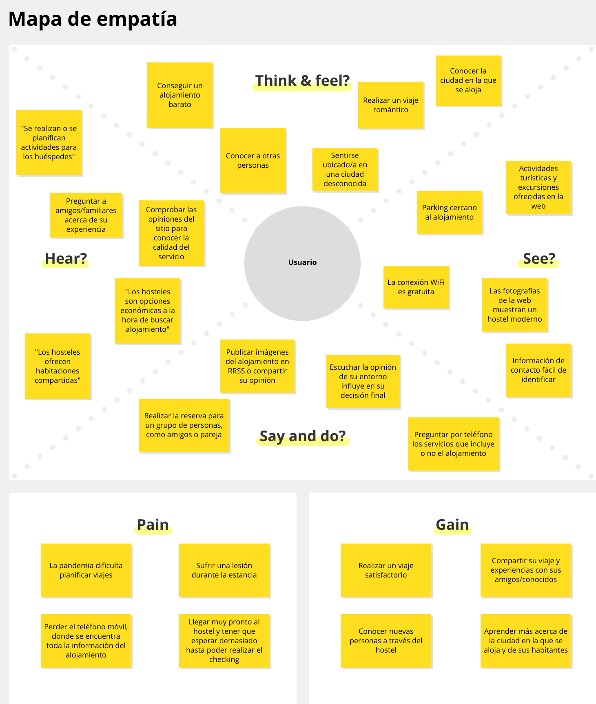

### PROPUESTA DE VALOR

El proyecto trata de incluir al hostel un apartado extra donde las discotecas/pubs/cafeterías de la zona puedan publicar sus fiestas semanales y promociones, incluyendo todos los datos necesarios. Este proyecto beneficia al hostel ya que aumenta las actividades de las que dispone, y tambien beneficia a los otros negocios ya que pueden dirigirse directamente a un público, normalmente joven.
El horario de las fiestas son 24 horas, por lo que el público será de todas las edades.

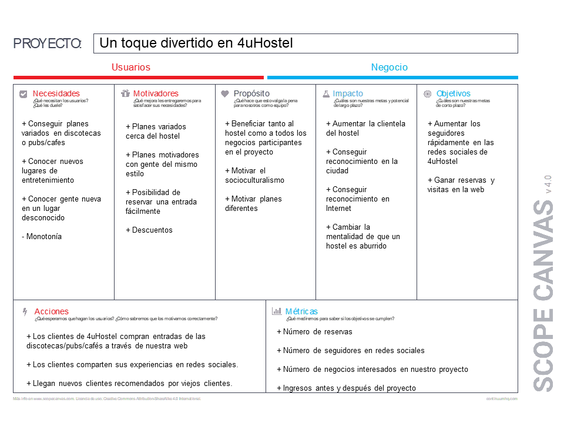

### TASK ANALYSIS

* User Task Matrix 

En este proyecto se pueden ver clientes de todas las edades y perfiles, pero normalmente será gente joven la interesada en esta idea.
Definimos los siguientes perfiles:
    
**Parejas** - Público que viene en pareja con todo tipo de planes (normalmente románticos), pueden ser de cualquier edad.

**Grupos** - Público que viene en grupo con una relación amistosa, buscando planes para muchas personas.

**Adultos** - Público normalmente mayor de 40 años que busca planes más relajados, como salones de baile, juegos de mesa y otros relacionados.

A continuación podemos ver la User Task Matrix creada a partir de los usuarios descritos anteriormente.

| | Parejas | Grupos | Adultos |
| -- | -- | -- | -- | -- |
| Hacer y ver valoraciones |  M | H | L |
| Reservar una entrada en un negocio | H | H | H |
| Realizar pagos a través de la app | H | H | L |
| Buscar tipo de establecimiento | H | M | M |
| Consultar las personas apuntadas al evento | H | H | L |
| Chatear con las personas apuntadas al evento | L | H | M |

### ARQUITECTURA DE INFORMACIÓN

* Sitemap 

La siguiente imagen describe la navegación que el usuario podrá realizar dentro de la plataforma.
No existe una vista de login ya que el proyecto a desarrollar es un microsite dentro de la plataforma existente de 4uHostel. Este proyecto está dirigido para los clientes del hostel que ya estaban registrados anteriormente. Los eventos se pueden compartir pero para comprar las entradas debe estar registrado; en caso contrario se redirige al usuario a una pestaña de login.

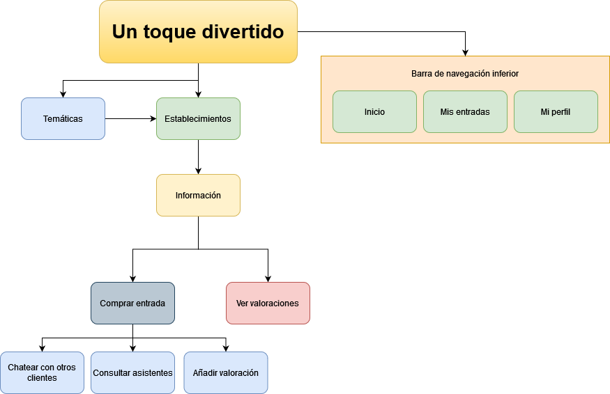

* Labelling 
En la siguiente tabla se detalla la información contenida en cada una de las secciones que contiene el proyecto, indicando la finalidad de ellas.

Término | Significado     
| ------------- | -------
  Temáticas  | Sección para ver las temáticas de todos los eventos publicados por los negocios.
  Establecimientos  | Sección para ver todos los establecimientos que tienen eventos publicados en la web.
  Informacion  | Sección para consultar el fin de este proyecto y las políticas de privacidad.
  Comprar entrada  | Sección donde el cliente puede comprar una entrada de un evento publicado.
  Chatear con otros clientes  | Sección donde el cliente, una vez comprada la entrada del evento, puede chatear con los demás asistentes.
  Consultar asistentes  | Sección donde el cliente, una vez comprada la entrada del evento, puede consultar los demás asistentes.
  Añadir valoracion  | Sección donde el cliente, una vez pasado el evento, puede añadir una valoración de su experiencia.
  Ver valoraciones  | Sección donde el cliente puede ver las valoraciones pasadas del establecimiento/evento.

### Prototipo Lo-FI Wireframe 
No proponemos sección de Login ya que nuestro proyecto está incrustado en la plataforma de 4uHostel.
Comenzamos en la pantalla de Inicio y podemos navegar según lo descrito en el sitemap.

Pantalla principal.
En ella el cliente puede ver las temáticas de los eventos publicados y, si ya tiene claro el establecimiento que quiere visitar, puede consultarlos directamente.
Suponemos que en el logotipo se da un breve y conciso resumen de lo que trata este proyecto.

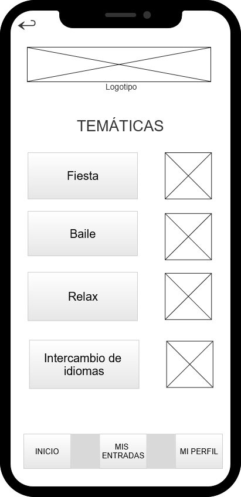
Pestaña de temáticas de eventos
En ella el cliente puede seleccionar la temática que le interesa y se le ofrecerán los eventos relacionados con la misma. 
Hay una fotografía asociada a cada temática

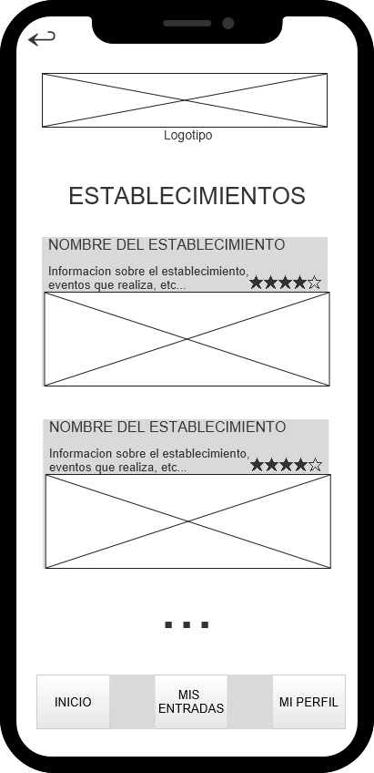
Pestaña de establecimientos
En esta pestaña aparecerán los establecimientos que han publicado eventos en 4uHostel con la posibilidad de pinchar en ellos y ver los eventos disponibles.

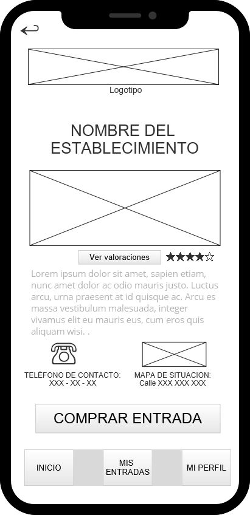
Pestaña de un establecimiento seleccionado - evento
En ella el cliente puede ver la media de valoraciones que tiene por parte de los clientes por medio de “estrellitas”. Además, puede navegar a otra pestaña para ver las opiniones explícitamente.
En esta pestaña se muestra la información del evento, situación y un teléfono de contacto.
Si le convence puede hacer click en “Comprar entrada” y le llevará a la pestaña a continuación.

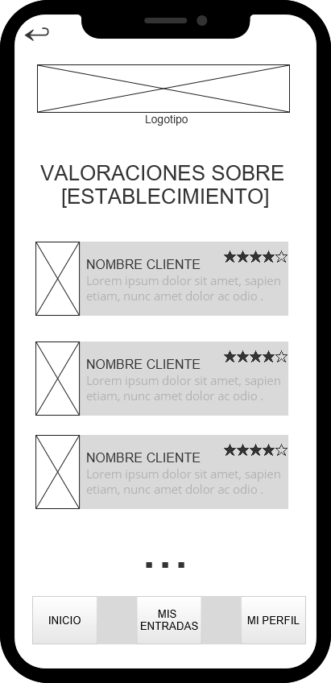
Pestaña de valoraciones sobre el establecimiento
En ella el cliente puede ver todas las reseñas que otros clientes han dejado al establecimiento.

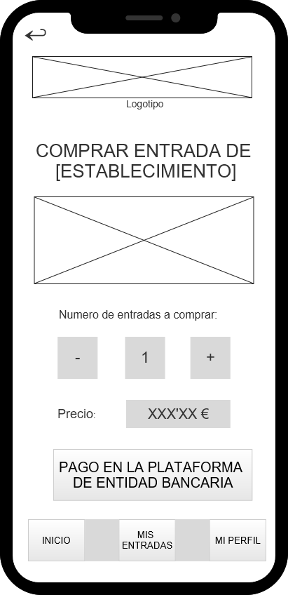
Pestaña de evento seleccionado - comprar entrada
Una vez el cliente se decide del evento al que desea asistir, lo selecciona y obtiene esta pantalla, con la posibilidad de comprar 1 o varias entradas, viendo el precio en todo momento.
Existe un botón que le redirigiría a una plataforma externa de pasarela de pago.

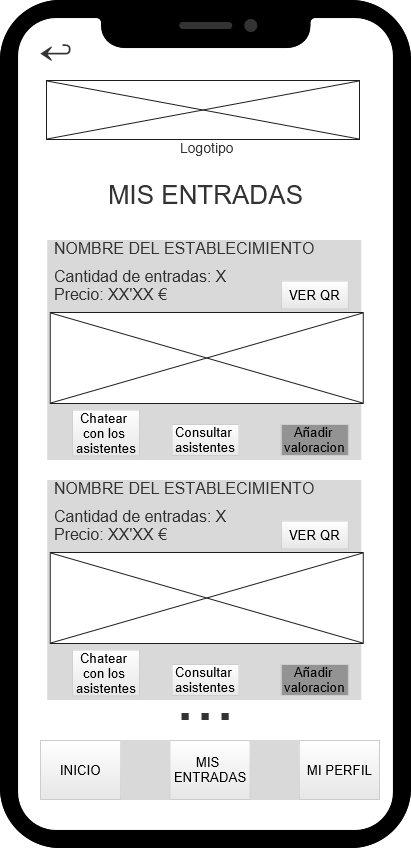
Pestaña de “Mis entradas”
El cliente puede ver todas sus entradas compradas con información general de ellas.
Además, a partir de una entrada puede chatear o ver a los asistentes al evento e incluso añadir una valoración al establecimiento.
Se ha puesto el botón “Añadir valoración” más oscuro ya que sólo estará disponible una vez haya finalizado el evento.

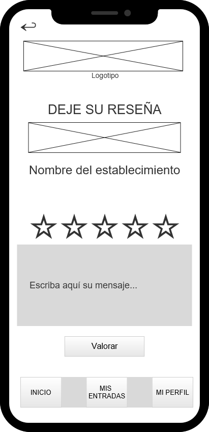
Pestaña para dejar una reseña a un establecimiento
El cliente puede valorar del 1-5 mediante estrellitas y puede dejar un comentario en forma de texto.

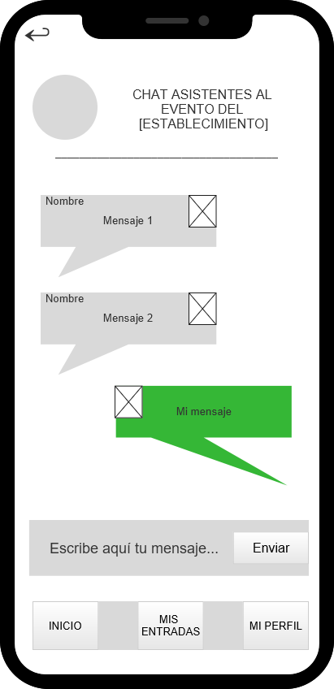
Pestaña de “Chat de asistentes al evento”
Es una pestaña sencilla donde aparecen los mensajes enviados por los demás asistentes, donde el cliente también puede comunicarse.
En ella, se ve claramente el nombre y una fotografía de la persona que está hablando.

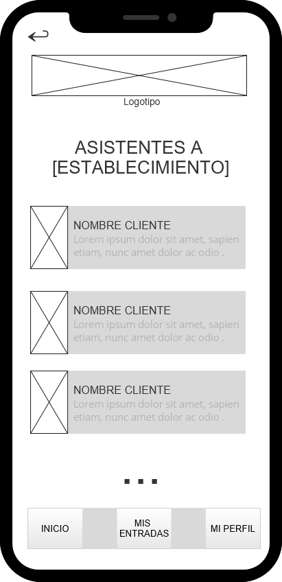
Pestaña de consulta de asistentes al evento
En esta pestaña el cliente puede ver todos los asistentes al evento.

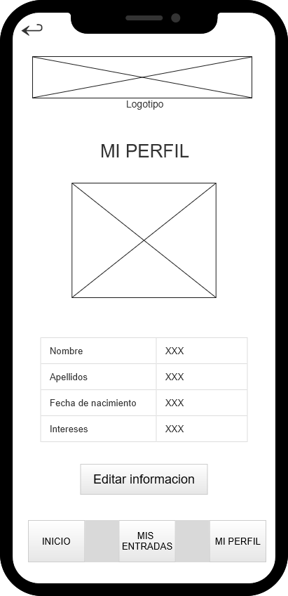
Pestaña de “Mi perfil”
El cliente puede editar su información en esta pestaña

### Conclusiones  
Concluímos que esta etapa ha servido para definir el producto que queremos desarrollar y es muy importante a la hora de planificar un proyecto, ya que esta es la base donde se apoyarán el resto de etapas. En esta etapa nos ponemos en la situación del cliente en todo momento y diseñamos el producto según sus necesidades.

### Correcciones aplicadas
- Cambio de una estructura del modelo demasiado jerárquica a una más adaptada a los deseos del cliente.
- Añadida la funcionalidad de compartir un evento
- Cambio de los nombres de eventos excesivamente específicos 
- Unión en "task matrix" de amigos y jóvenes, obteniendo como resultado *grupos*
- Ajuste del "empathy map" 
