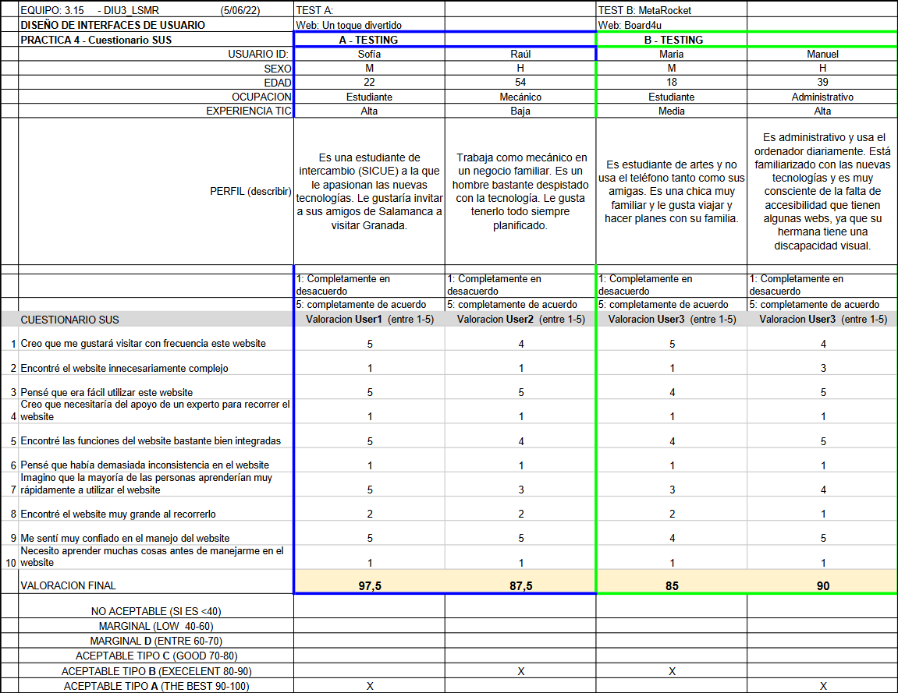
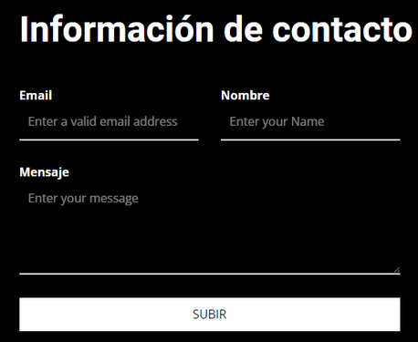

# DIU - Practica 4, entregables

 4.a Caso asignado
----
El proyecto asignado  se llama Board 4U, y permite a los clientes de 4uHostel ver actividades, ofertas y experiencias de viajeros y turistas alrededor de Granada.
El repositorio de Github se encuentra en https://github.com/vdeq79/DIU .

 4.b User Testing
----

>>> Seleccione 4 personas ficticias. Exprese las ideas de posibles situaciones conflictivas de esa persona en las propuestas evaluadas. Asigne dos a Caso A y 2 al caso B
 

| Usuarios | Sexo/Edad     | Ocupación   |  Exp.TIC    | Personalidad | Plataforma | TestA/B
| ------------- | -------- | ----------- | ----------- | -----------  | ---------- | ----
| Sofía  | M / 22   | Estudiante  | Alta       | Tipo: 2 Actividad: 3 Emoción: 3 | Windows       | A 
| Raúl  | H / 54   | Mecánico  | Baja       | Tipo: 6 Actividad: 4 Emoción: 5      | Windows        | A 
| María  | M / 18   | Estudiante     | Media        | Tipo: 3 Actividad: 2  Emoción: 6    | Teléfono (iOS)      | B 
| Manuel  | H / 39   | Administrativo  | Alta       | Tipo: 4 Actividad: 5  Emoción: 3      | Linux        | B 

Sofía: Es una estudiante de intercambio (SICUE) a la que le apasionan las nuevas tecnologías. Le gustaría invitar a sus amigos de Salamanca a visitar Granada.

Raúl: Trabaja como mecánico en un negocio familiar. Es un hombre bastante despistado con la tecnología. Le gusta tenerlo todo siempre planificado.

María: Es estudiante de artes y no usa el teléfono tanto como sus amigas. Es una chica muy familiar y le gusta viajar y hacer planes con su familia.

Manuel: Es administrativo y usa el ordenador diariamente. Está familiarizado con las nuevas tecnologías y es muy consciente de la falta de accesibilidad que tienen algunas webs, ya que su hermana tiene una discapacidad visual.

. 4.c Cuestionario SUS
----

>>> Usaremos el **Cuestionario SUS** para valorar la satisfacción de cada usuario con el diseño (A/B) realizado. Para ello usamos la [hoja de cálculo](https://github.com/mgea/DIU19/blob/master/Cuestionario%20SUS%20DIU.xlsx) para calcular resultados sigiendo las pautas para usar la escala SUS e interpretar los resultados
http://usabilitygeek.com/how-to-use-the-system-usability-scale-sus-to-evaluate-the-usability-of-your-website/)
Para más información, consultar aquí sobre la [metodología SUS](https://cui.unige.ch/isi/icle-wiki/_media/ipm:test-suschapt.pdf)

 4.d Usability Report
----

>> Añadir report de usabilidad para práctica B (la de los compañeros)

Se puede acceder al siguiente documento para ver el Usability Report
[PDF](P4UsabReport_Board4U_doneby_DIU3_LSMR.pdf).

>>> Valoración personal 

La aplicación sigue un sitemap sencillo y predecible, además de un uso de colores aceptable, parecido a Ryanair. Cumple perfectamente con su función pero tiene algunos fallos en los formularios, como el idioma que se emplea, por ejemplo vemos que la información siguiente está en inglés, aunque el idioma de la web es español:

Se valora positivamente el feedback que se le da al cliente cuando éste rellena un formulario, aunque este feedback aparezca durante muy poco tiempo y en inglés.

Por ejemplo, si un cliente va con su familia, al hacer la reserva sólo se permite reservar una plaza, por lo que el usuario puede no quedar satisfecho.
Se podría incluir un calendario que muestre al usuario la fecha y hora de las actividades, ya que, de la forma que está planteada la web, el usuario debe consultar cada actividad para saber su horario.
La web no le permite al usuario realizar una búsqueda de actividades, por lo que se evalúa negativamente.
