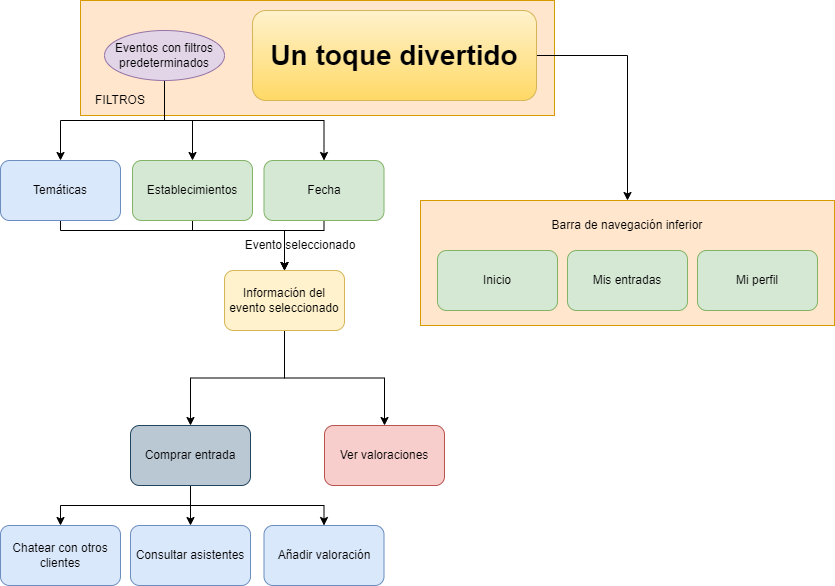

# DIU22
Prácticas Diseño Interfaces de Usuario 2021-22 (Tema: Hostels) 

Grupo: DIU1_LSMR.  Curso: 2021/22 
Updated: 11/2/2022

Proyecto: 
>>> Decida el nombre corto de su propuesta en la práctica 2 

Descripción: 

>>> Describa la idea de su producto en la práctica 2 

Logotipo: 
>>> Opcionalmente si diseña un logotipo para su producto en la práctica 3 pongalo aqui

Miembros
 * :bust_in_silhouette:  Laura Sánchez Sánchez     :octocat:     
 * :bust_in_silhouette:  Miguel Reyes Martínez     :octocat:

----- 

# Proceso de Diseño 

## Paso 1. UX Desk Research & Analisis 

 1.a Competitive Analysis
-----

Compararemos el hostel 4uHostel (https://www.4uhostel.com/) frente a Woohoo Group (https://www.woohoo-group.com/es/) y Soho (http://www.feelhostels.com/hostel_soho.php) y veremos los puntos fuertes y débiles de cada uno, con el fin de sacar una conclusión de la calidad de la página web del hostel asignado. Hemos elegido estos dos hosteles para poder comparar 4uHostel con uno muy bueno y con otro muy mejorable.

 1.b Persona
-----

Las personas seleccionadas son dos chicas jóvenes que desean encontrar un alojamiento barato por distintos motivos.

Mei:

Claudia:

 1.c User Journey Map
----

Hemos escogido estas experiencias ya que siguen algunos de los pasos que seguiríamos nosotros y nuestros amigos como gente joven al reservar un alojamiento en una ciudad que desconocemos.

Mei (estudiante de historia):

Claudia (influencer):

 1.d Usability Review
----
- Enlace al documento [PDF](P1/RevisionUsabilidadLSMR.pdf).
- Valoración final: 51 - Moderate
- Comentario sobre la valoración: Es una página web que deja que desear, sobre todo en la cantidad de información que se detalla.

## Paso 2. UX Design  

 2.a Mapa de empatía
----
Mapa de empatía.
Hemos elaborado el siguiente mapa de empatía:

 2.b ScopeCanvas
----
>>> Propuesta de valor 

Las discotecas de la zona pueden publicar sus eventos y se proporcionarán descuentos.

 

2.b Tasks analysis 
-----

| | Parejas | Grupos | Adultos |
| -- | -- | -- | -- | 
| Hacer y ver valoraciones |  M | H | L |
| Reservar una entrada en un negocio | H | H | H |
| Realizar pagos a través de la app | H | H | L |
| Buscar tipo de establecimiento | H | M | M |
| Consultar las personas apuntadas al evento | H | H | L |
| Chatear con las personas apuntadas al evento | L | H | M |

----

La siguiente imagen describe la navegación que el usuario podrá realizar dentro de la plataforma.

En la siguiente tabla se detalla la información contenida en cada una de las secciones que contiene el proyecto, indicando la finalidad de ellas.

Término | Significado     
| ------------- | -------
  Principal  | Sección donde se ven todos los eventos a partir de unos filtros aplicados. En ella se pueden aplicar los filtros deseados.
  Información del evento  | Sección para consultar toda la información del evento seleccionado.
  Comprar entrada  | Sección donde el cliente puede comprar una entrada de un evento publicado.
  Chatear con otros clientes  | Sección donde el cliente, una vez comprada la entrada del evento, puede chatear con los demás asistentes.
  Consultar asistentes  | Sección donde el cliente, una vez comprada la entrada del evento, puede consultar los demás asistentes.
  Añadir valoracion  | Sección donde el cliente, una vez pasado el evento, puede añadir una valoración de su experiencia.
  Ver valoraciones  | Sección donde el cliente puede ver las valoraciones pasadas del establecimiento/evento.
  

 2.d Wireframes
-----

Para ver los bocetos, ver dentro de la carpeta "P2".
En todas las pestañas el cliente ve dónde se sitúa en cada momento y tiene la posibilidad de ir hacia atrás en cualquier paso.

## Paso 3. Mi UX-Case Study (diseño)

 3.a Moodboard
-----

El Moodboard se puede ver aquí: https://app.milanote.com/1NRDvb1hGpPB2i?p=TngnykVDxAe

El logotipo es cuadrado, pero para algunas situaciones se utilizará el siguiente con el fin de ajustarse al espacio:

  3.b Landing Page
----

 3.c Guidelines
----

Para ajustar los patrones que utilizaremos en nuestra aplicación, veremos las necesidades básicas y comunes de los clientes con la finalidad de mostrarle una aplicación amena y fácil de usar.

**Home Link:** el usuario podrá volver a la página de inicio fácilmente haciendo click en el logo.
Pestañas de navegación: el usuario tendrá siempre arriba una breve descripción de la pestaña en la que se encuentra.

**Interacción social - Chat:** Los usuarios podrán interactuar a través de un chat común.

**Tratamiento de datos / Filtros:** Los usuarios necesitan realizar una búsqueda utilizando filtros contextuales que acoten los resultados de la búsqueda.

**Input Feedback:** el usuario podrá saber si ha introducido correctamente los campos gracias al feedback.

**Formularios - Calendario de selección:** El usuario quiere buscar o enviar información en base a una fecha o rango de fechas

**Compras - Página del producto:** El usuario podrá saber todos los detalles del evento para decidir si realiza su compra.

**Incrementando Frecuencia - Consejo a un amigo:** El usuario podrá compartir los eventos.

  3.d Mockup
----

Hemos escogido la opción B ( LAYOUT Protopie ) para la realización del prototipo.

En todas las pestañas existe una barra de navegación que permite acceder a las pestañas principales, además de un botón de retroceso para volver a la pestaña anterior.
Pulsar en el logotipo de la aplicación enviará al usuario a la pantalla principal.
Dentro de la carpeta P3 se documenta cada pestaña.

https://cloud.protopie.io/p/8d977da933?touchHint=true&ui=true&scaleToFit=true&cursorType=touch&mockup=true&bgColor=%23F5F5F5&playSpeed=1&playerAppPopup=true 

 3.e ¿My UX-Case Study?
-----

**Aplicación móvil, principalmente para IOS**

Resumen del diseño de nuestra práctica: el cliente siempre dispone de una barra inferior que le permite navegar por las principales pestañas de la app. Además, siempre tiene un botón para “ir atrás”. Se usa el logotipo que más se ajusta a la sección; el logotipo siempre aparece y al pinchar en él, redirige al cliente a la página principal. Los colores se ajustan al logotipo y a la paleta elegida. Son adecuados a la temática y resaltan cuando es necesario. Los textos de información son claros y concisos. En cada sección se muestra un título que ayuda al cliente a saber en qué sección se encuentra. La aplicación está diseñada para que los puntos donde normalmente hace click el cliente sean alcanzables físicamente, sin tener que usar las dos manos.

## Paso 4. Evaluación 

 4.a Caso asignado
----
El proyecto asignado  se llama Board 4U, y permite a los clientes de 4uHostel ver actividades, ofertas y experiencias de viajeros y turistas alrededor de Granada.
El repositorio de Github se encuentra en https://github.com/vdeq79/DIU .

 4.b User Testing
----

>>> Seleccione 4 personas ficticias. Exprese las ideas de posibles situaciones conflictivas de esa persona en las propuestas evaluadas. Asigne dos a Caso A y 2 al caso B
 

| Usuarios | Sexo/Edad     | Ocupación   |  Exp.TIC    | Personalidad | Plataforma | TestA/B
| ------------- | -------- | ----------- | ----------- | -----------  | ---------- | ----
| Sofía  | M / 22   | Estudiante  | Alta       | Tipo: 2
Actividad: 3 
Emoción: 3
 | Web.       | A 
| Raúl  | H / 54   | Mecánico  | Baja       | Timido       | Web        | A 
| María  | M / 18   | Estudiante     | Media        | Emocional    | móvil      | B 
| Manuel  | H / 39   | Administrativo  | Alta       | Racional     | Web        | B 

. 4.c Cuestionario SUS
----

>>> Usaremos el **Cuestionario SUS** para valorar la satisfacción de cada usuario con el diseño (A/B) realizado. Para ello usamos la [hoja de cálculo](https://github.com/mgea/DIU19/blob/master/Cuestionario%20SUS%20DIU.xlsx) para calcular resultados sigiendo las pautas para usar la escala SUS e interpretar los resultados
http://usabilitygeek.com/how-to-use-the-system-usability-scale-sus-to-evaluate-the-usability-of-your-website/)
Para más información, consultar aquí sobre la [metodología SUS](https://cui.unige.ch/isi/icle-wiki/_media/ipm:test-suschapt.pdf)

>>> Adjuntar captura de imagen con los resultados + Valoración personal 

 4.d Usability Report
----

>> Añadir report de usabilidad para práctica B (la de los compañeros)

>>> Valoración personal 

## Conclusión final / Valoración de las prácticas

>>> (90-150 palabras) Opinión del proceso de desarrollo de diseño siguiendo metodología UX y valoración (positiva /negativa) de los resultados obtenidos  

